<p align="center">
  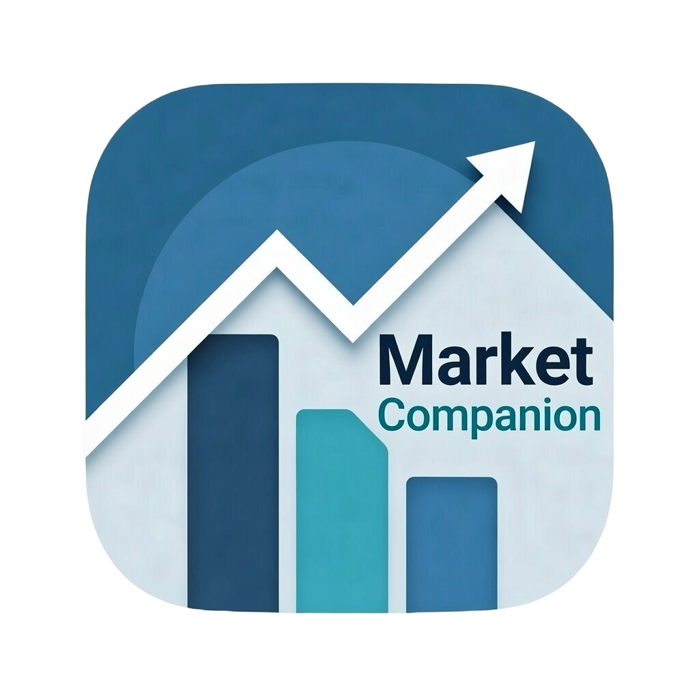
</p>

<h1 align="center">Market Companion</h1>

<p align="center">
  <strong>Your personal market intelligence dashboard for macOS.</strong><br>
  Real-time quotes, interactive charts, smart alerts, trade journaling, portfolio risk analytics, and automated market briefings — all in a native SwiftUI app.
</p>

<p align="center">
  
  
  
</p>

---

## Overview

Market Companion is a native macOS desktop application built for traders and investors who want a unified workspace for tracking the market, managing positions, journaling trades, and generating daily briefings. It connects to multiple market data providers and stores everything locally — your data never leaves your machine.

> **No API key required to get started.** The built-in mock data provider generates realistic demo data so you can explore every feature immediately.

---

## Features

### Dashboard
A real-time overview of your portfolio: holdings count, watchlist size, VIX proxy, market breadth, sector performance, upcoming earnings, and the latest news — all on one screen.

<p align="center">
  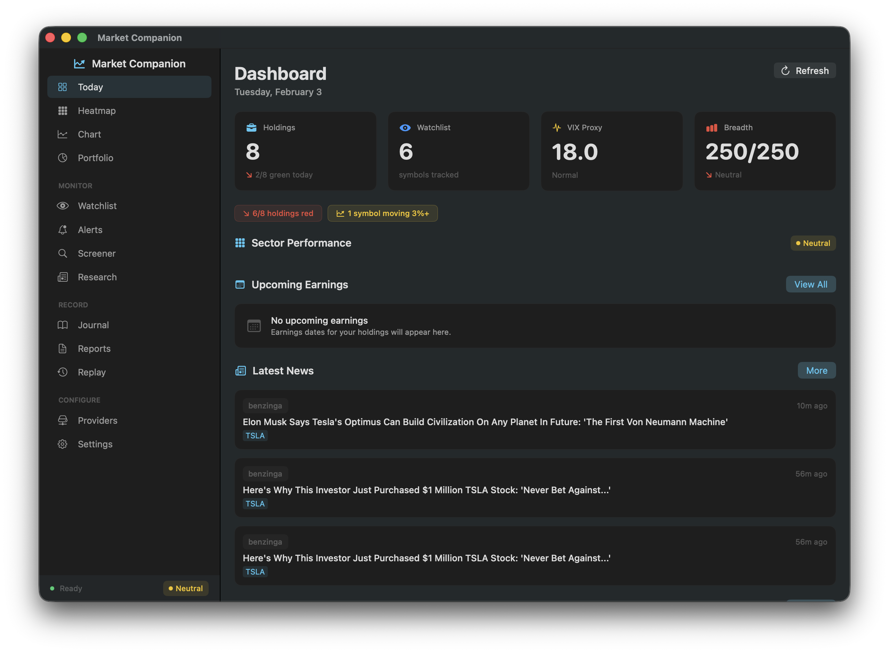
</p>

### Interactive Charts
Full candlestick charts with volume bars, multiple timeframes (1D to 1Y), technical indicator overlays, and symbol comparison mode. Click any symbol anywhere in the app to jump straight to its chart.

<p align="center">
  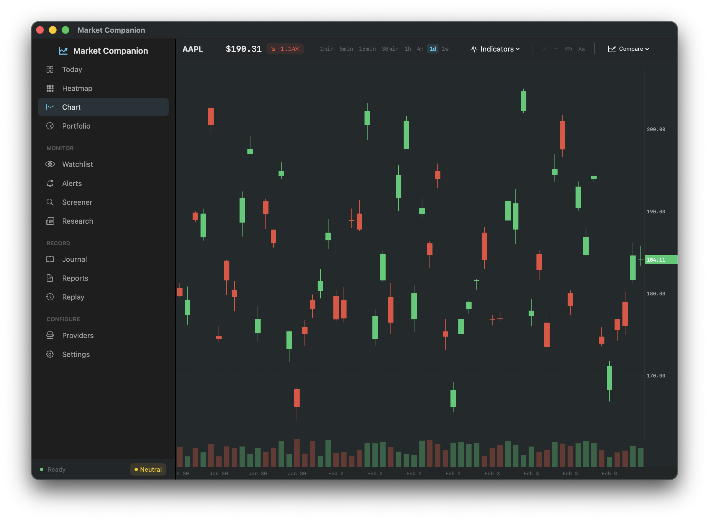
</p>

### Heatmap
Visual, color-coded grid of all your holdings and watchlist symbols. Sort by daily change %, volume, volatility, or sector. Each tile includes a mini sparkline for quick trend recognition.

<p align="center">
  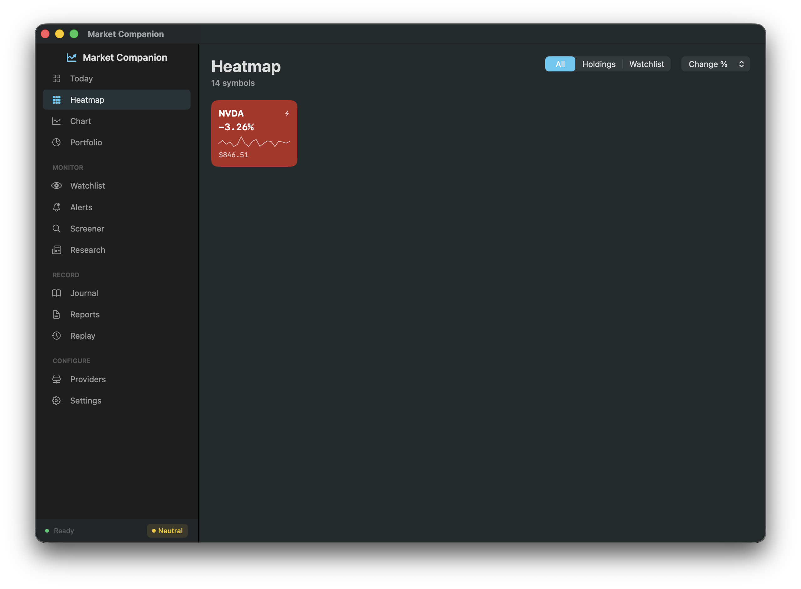
</p>

### Watchlist & Portfolio
Manage your holdings with cost basis tracking and your watchlist with custom reason tags (earnings play, momentum, unusual activity, sector rotation, etc.). Sparklines and live P&L for every position.

<p align="center">
  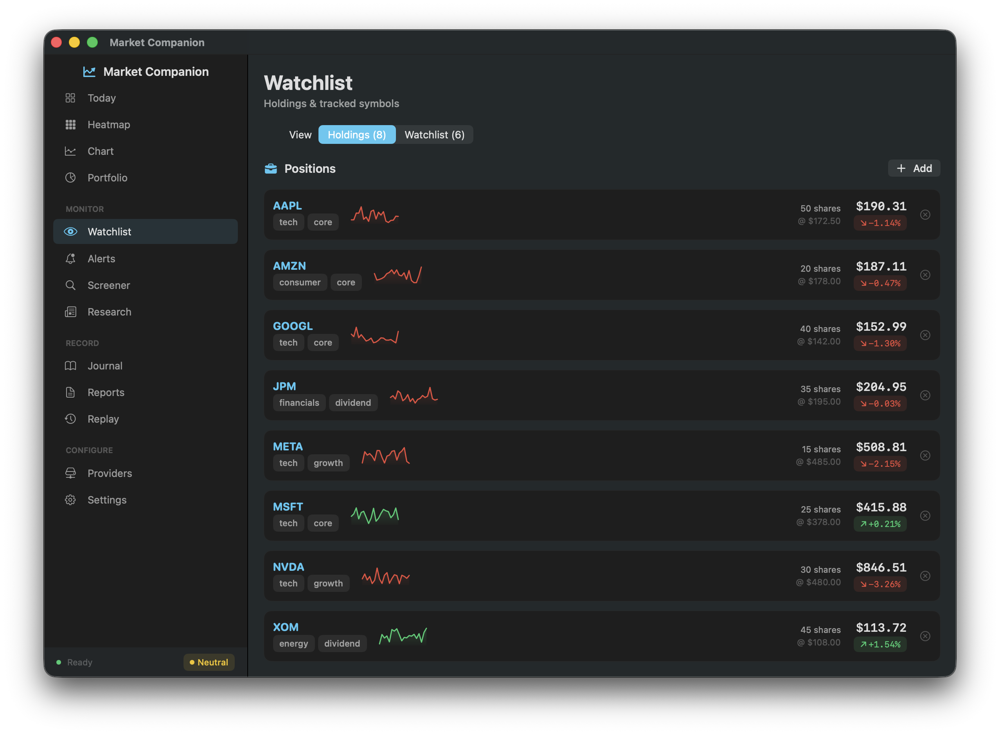
</p>

### Smart Alerts
Go beyond simple price alerts. Create custom rules from 14 different alert types spanning volume analysis, technical indicators, and candlestick pattern recognition. Triggered alerts appear in-app and as native macOS notifications. A built-in cooldown prevents duplicate alerts within the same hour.

<p align="center">
  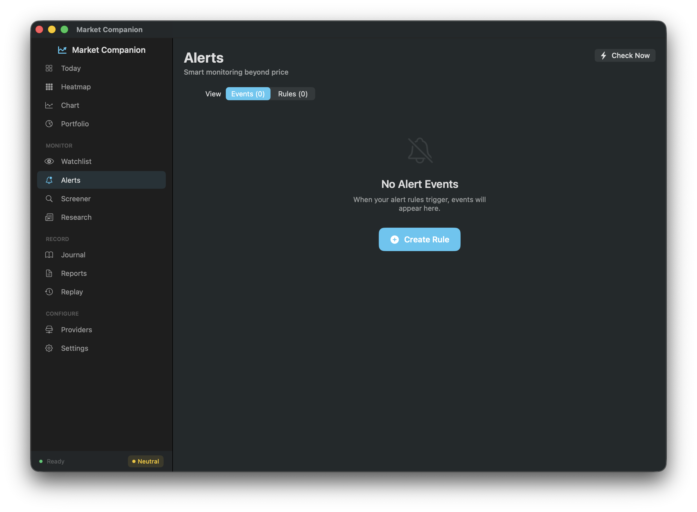
</p>

<details>
<summary><strong>All 14 Alert Types</strong></summary>
<br>

| Category | Alert Type | What It Detects |
|----------|-----------|-----------------|
| **Volume** | Volume Spike | Trading volume exceeding a configurable multiple of the average daily volume |
| **Trend** | Trend Break | Price crossing a 20-day moving average or breaking prior-day high/low levels |
| **Volatility** | Unusual Volatility | Intraday range (high minus low) exceeding a multiple of the typical daily range |
| **Momentum** | RSI Overbought | RSI(14) rising above a threshold (default: 70) |
| **Momentum** | RSI Oversold | RSI(14) falling below a threshold (default: 30) |
| **Momentum** | MACD Crossover | MACD histogram crossing the zero line (bullish or bearish) |
| **Volatility** | Bollinger Squeeze | Bollinger Band bandwidth contracting to a fraction of its average — often precedes a breakout |
| **Trend** | Price Above MA | Price crossing above a configurable-period simple moving average |
| **Trend** | Price Below MA | Price crossing below a configurable-period simple moving average |
| **Pattern** | Bullish Engulfing | A bullish engulfing candlestick pattern — potential reversal signal at support |
| **Pattern** | Bearish Engulfing | A bearish engulfing candlestick pattern — potential reversal signal at resistance |
| **Pattern** | Hammer | A hammer candlestick pattern — potential bottoming signal after a decline |
| **Pattern** | Doji | A doji candlestick pattern — signals market indecision and possible reversal |
| **Advanced** | Composite | Combine multiple conditions (RSI, volume, price, MACD) with AND logic into a single rule |

</details>

### Screener
Filter your universe by change %, win/loss ratio, price range, volume, and more. Toggle between holdings-only and watchlist-only views. Sort results by any metric.

<p align="center">
  
</p>

### Research
Aggregated news feed and earnings calendar for your tracked symbols. Filter by ticker or time range, with sentiment tagging and direct links to source articles.

<p align="center">
  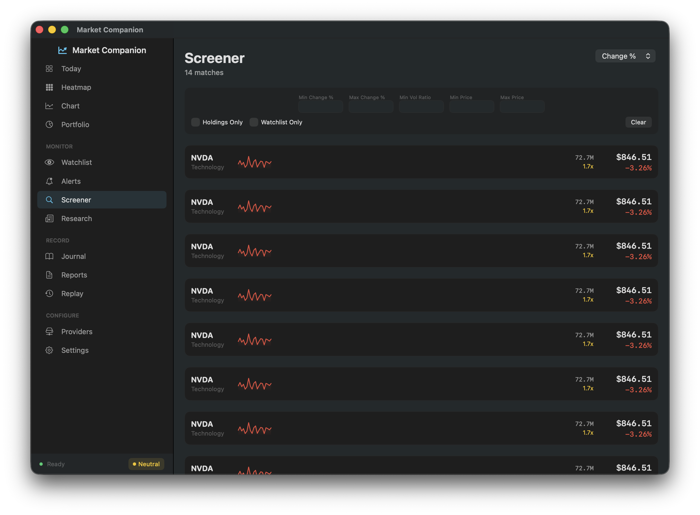
</p>

### Trade Journal
Log trades with automatic market context capture — VIX level, market breadth, volatility regime, and time of day are recorded alongside every entry. Built-in analytics surface patterns from your trading history.

<p align="center">
  
</p>

### Automated Reports
Morning and closing bell briefings generated automatically. Includes market regime analysis, sector rotation signals, key technical levels, and position summaries. Export to PDF, copy to clipboard, or listen via text-to-speech.

<p align="center">
  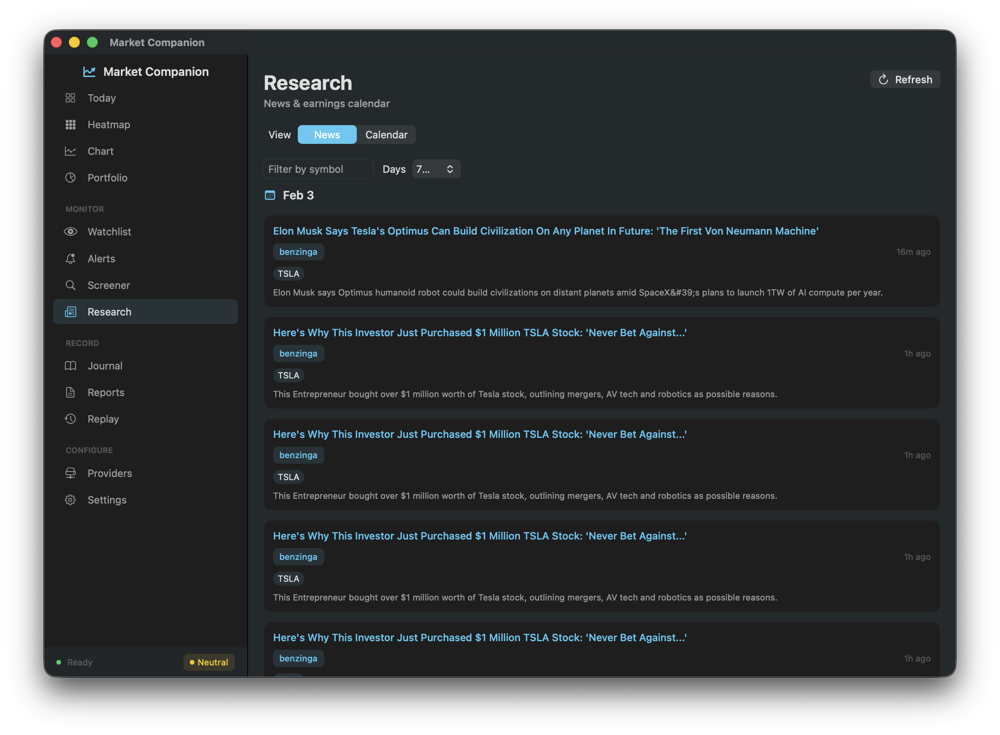
</p>

### Market Replay
Step through historical candles bar-by-bar to practice trading decisions on real past data. Place simulated trades, track your P&L, and compare your results against buy-and-hold.

<p align="center">
  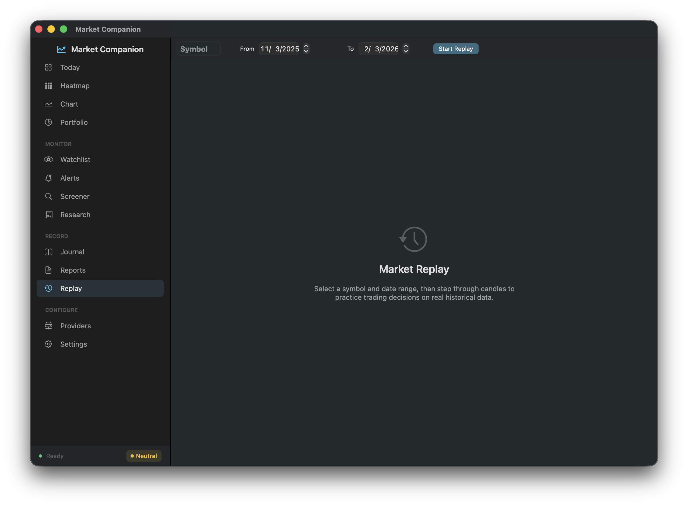
</p>

### Portfolio Risk Analytics
Correlation matrix, sector concentration (Herfindahl index), annualized volatility, and what-if analysis for hypothetical position changes.

### Multiple Data Providers
Connect to Alpaca, Finnhub, Alpha Vantage, EODHD, MarketStack, or use the built-in mock provider. Primary/fallback provider configuration with automatic failover.

<p align="center">
  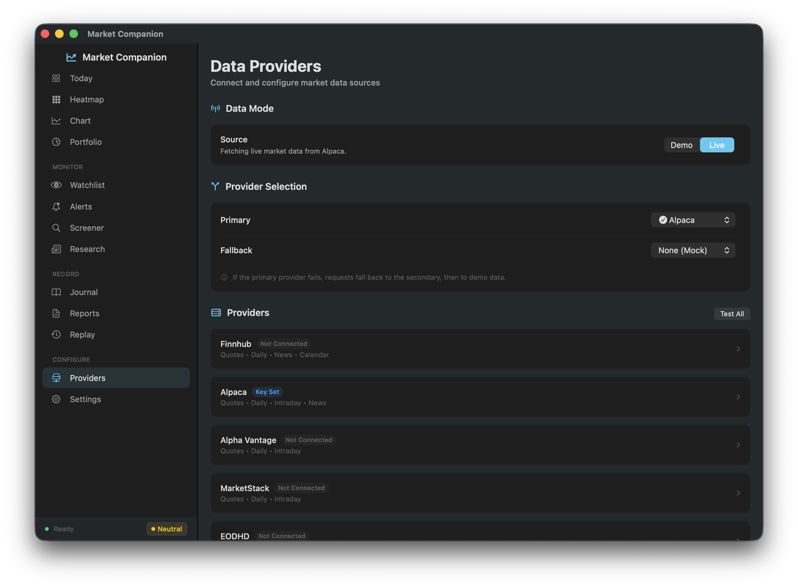
</p>

### Settings & Customization
Configure report schedules, default report mode (concise vs. detailed), audio briefing speech rate, and background scheduling via macOS LaunchAgent.

<p align="center">
  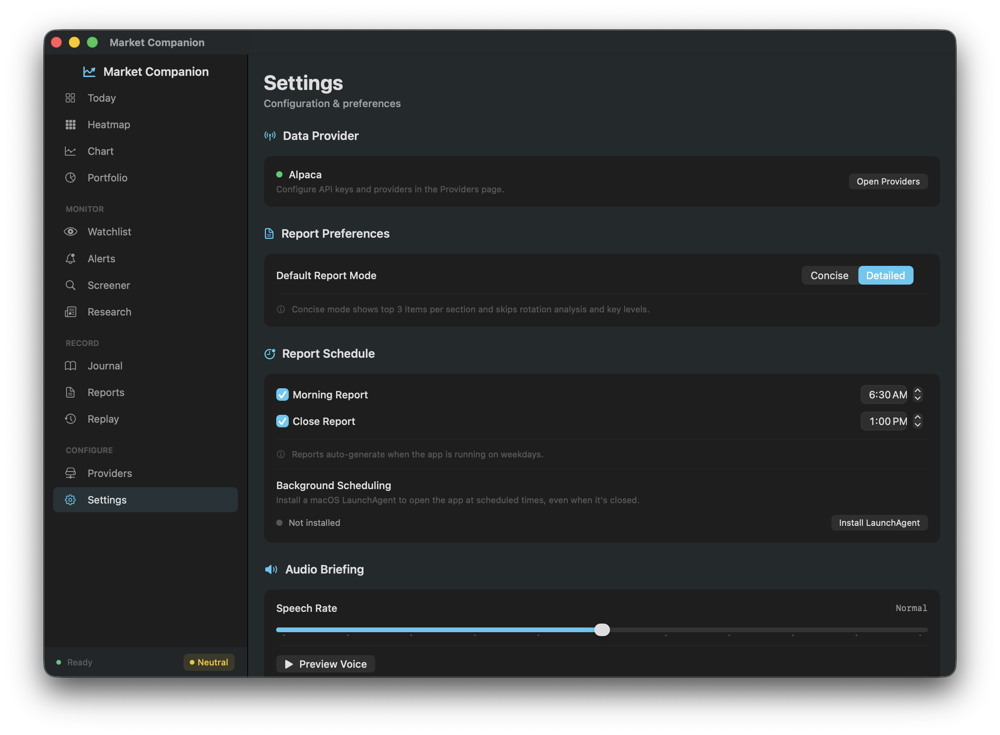
</p>

---

## Getting Started

### Requirements

| Requirement | Version |
|-------------|---------|
| macOS | 14.0+ (Sonoma) |
| Xcode | 15+ |
| XcodeGen | Latest (`brew install xcodegen`) |

### Quick Start

```bash
# Clone the repository
git clone https://github.com/bytePatrol/Market_Companion.git
cd Market_Companion

# Generate the Xcode project
xcodegen generate

# Open in Xcode and build (Cmd+R)
open MarketCompanion.xcodeproj
```

The app launches with the **Mock Data Provider** enabled by default — you'll see realistic demo data immediately with no configuration needed.

### Connecting a Live Data Provider

1. Open **Settings** > **Providers**
2. Select your provider (Alpaca, Finnhub, Alpha Vantage, EODHD, or MarketStack)
3. Enter your API key — it's stored securely in the macOS Keychain
4. Switch the data mode from **Demo** to **Live**

---

## Project Structure

```
Market_Companion/
├── MarketCompanion/
│   ├── App/                    # App entry point & state management
│   ├── Design/                 # Theme, colors, typography, spacing
│   │   └── Components/         # Reusable UI: CardView, TagPill, Sparkline, etc.
│   ├── Models/                 # Data models (Holding, Quote, Trade, NewsItem, etc.)
│   ├── Persistence/            # GRDB database manager & repositories
│   ├── DataProviders/          # MarketDataProvider protocol + implementations
│   ├── Services/               # Keychain, scheduling, audio, HTTP client
│   ├── Resources/              # Asset catalog (icons, colors)
│   └── Views/                  # Feature views organized by module
│       ├── Dashboard/          # Market overview
│       ├── Chart/              # Candlestick charts & trade planning
│       ├── Heatmap/            # Color-coded symbol grid
│       ├── Watchlist/          # Holdings & tracked symbols
│       ├── Alerts/             # Smart alert rules & events
│       ├── Screener/           # Symbol filtering & scanning
│       ├── Research/           # News feed & earnings calendar
│       ├── Journal/            # Trade logging & analytics
│       ├── Reports/            # Automated briefings & PDF export
│       ├── Replay/             # Historical market replay
│       ├── Portfolio/          # Risk analytics & correlation
│       ├── Companion/          # Compact floating window
│       ├── Settings/           # App configuration
│       ├── Help/               # In-app help documentation
│       └── Onboarding/         # First-run setup
├── MarketCompanionTests/       # Unit tests
├── LaunchAgent/                # Scheduled report scripts
├── screenshots/                # App screenshots
├── project.yml                 # XcodeGen specification
└── README.md
```

---

## Data Provider Architecture

Market Companion uses a pluggable provider protocol, making it straightforward to add support for any market data API:

```swift
protocol MarketDataProvider {
    var name: String { get }
    var isLive: Bool { get }
    func fetchQuotes(symbols:) async throws -> [Quote]
    func fetchDailyBars(symbol:from:to:) async throws -> [DailyBar]
    func fetchMarketOverview() async throws -> MarketOverview
    func fetchIntradayPrices(symbol:) async throws -> [IntradayPoint]
}
```

**Included providers:**

| Provider | Capabilities |
|----------|-------------|
| Mock | Full demo data — no API key required |
| Alpaca | Quotes, daily bars, intraday, news |
| Finnhub | Quotes, daily bars, news, calendar |
| Alpha Vantage | Quotes, daily bars, intraday |
| EODHD | Quotes, daily bars, intraday |
| MarketStack | Quotes, daily bars, intraday |

---

## Scheduled Reports (LaunchAgent)

Automate morning and closing bell report generation, even when the app isn't in the foreground:

```bash
# Install the LaunchAgent
./LaunchAgent/install.sh

# Uninstall
./LaunchAgent/uninstall.sh

# Verify it's running
launchctl list | grep marketcompanion
```

**Default schedule:**
- **6:30 AM PT** — Morning briefing
- **1:00 PM PT** — Close summary

---

## Where Your Data Lives

| Item | Location |
|------|----------|
| Database | `~/Library/Application Support/MarketCompanion/market_companion.sqlite` |
| API Keys | macOS Keychain (`com.marketcompanion.keys`) |
| LaunchAgent | `~/Library/LaunchAgents/com.marketcompanion.scheduler.plist` |
| Logs | `~/Library/Logs/MarketCompanion/` |

---

## Running Tests

```bash
xcodebuild test \
  -project MarketCompanion.xcodeproj \
  -scheme MarketCompanion \
  -destination 'platform=macOS'
```

---

## Tech Stack

- **Swift 5.9+** / **SwiftUI** — Native macOS UI
- **GRDB** — Local SQLite persistence via [GRDB.swift](https://github.com/groue/GRDB.swift)
- **Swift Charts** — Apple's native charting framework
- **UserNotifications** — Native macOS alert notifications
- **AVSpeechSynthesizer** — Text-to-speech for audio briefings
- **Core Graphics** — PDF report export
- **Security.framework** — Keychain credential storage

---

## Privacy

Market Companion is designed with privacy as a first principle:

- All data is stored **locally on your Mac**
- **No cloud sync**, no telemetry, no analytics
- API keys are stored in the **macOS Keychain** — never in plain text
- **"Delete All Data"** option available in Settings for a clean reset

---

## License

This project is licensed under the MIT License. See [LICENSE](LICENSE) for details.
